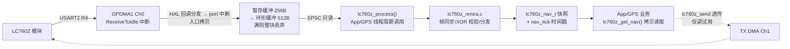

# LC760Z BSP 模块设计文档

## 1. 模块概述

本模块提供 Quectel LC760Z(00) GNSS 模块的底层驱动，职责限定为：**通过 UART 收到定位语句并解析成结构化快照**。业务逻辑（位置共享、恢复策略、功耗决策等）全部在 `App/GPS` 下以线程方式实现，本模块不掺和。

LC760Z(00) 是单频多星系 GNSS 模块（GPS L1 C/A / GLONASS L1 / Galileo E1 / BDS B1I+B1C / QZSS），内置 LNA 与 SAW 滤波器，支持 AGNSS 与 1PPS，通信接口为 UART（默认 115200）与 I2C（本工程只用 UART）。

**资料**：

- 在线资料：<https://www.quectel.com.cn/product/gnss-lc760z>
- 本地文档：`..\Docs\LC760Z`
  - `Quectel_LC760Z00_GNSS_模块产品规格书_V1.4.pdf`（模块能力与性能指标）
  - `Quectel_LC760Z00_硬件设计手册_V1.3.pdf`（引脚、上电/复位/低功耗时序，重点第 3.4、4.1、4.2 节）
  - `Quectel_LC26xZ系列LC76xZ00_GNSS_协议规范_V1.5.pdf`（NMEA / 二进制协议，重点第 2、3 章）
  - `Quectel_LC26xZ系列LC76xZ00_AGNSS_应用指导_V1.1.pdf`（v2+ AGNSS 功能参考）

## 2. 硬件说明

### 2.1 接口与引脚

| 信号 | 引脚 | 说明 |
|---|---|---|
| USART2_TX | PA2 (AF7) | MCU → 模块，GPDMA1 Channel1 |
| USART2_RX | PA3 (AF7) | 模块 → MCU，GPDMA1 Channel0 |
| GPS_NRST | PB8 | 模块 RESET_N，低电平有效 |

- UART 参数：115200-8-N-1，无硬件流控；DMA 均为 NORMAL 模式（CubeMX 生成，见 `Core/Src/usart.c`）。
- **`PW_EN` 与 GPS 模块无关**，驱动禁止触碰该引脚；模块 VCC 由硬件常供。
- `Core/Src/gpio.c` 初始化时将 `GPS_NRST` 写为低电平，即**上电后模块被按在复位态**，必须由驱动 init 释放复位模块才会启动。

### 2.2 复位与上电时序要点（硬件手册 V1.3 第 3.4 / 4.2.1 节）

- `RESET_N` 拉低 ≥ 100 ms 可复位模块，同时也是退出 Standby / Backup 低功耗模式的手段（v1 只在 init 释放复位）。
- 上电顺序：VCC 稳定后再释放 `RESET_N`。本板 VCC 硬件常供，MCU 复位释放前模块已被按住，天然满足「先供电后放复位」。
- `V_BCKP` 备份域需常供才能实现温/热启动（缩短 TTFF），由硬件保证，驱动无需干预。

## 3. 需求结论

产品形态为**户外手持定位设备**，定位数据用于**与他人共享实时位置**，更新率 1 Hz 即可。据此分阶段收敛如下：

| 维度 | v1（当前实现） | 推迟（v2+） |
|---|---|---|
| 数据 | 经纬度 + UTC + 定位状态 + 海拔（解析 RMC、GGA） | 速度/航向、GSV 卫星详情、`PQTM*` 专有语句 |
| 时间 | 仅作为快照字段解析出来 | RTC 校准（解析时保留日期/状态字段即可支撑） |
| 模块配置 | **零配置**，完全信任出厂默认（115200、默认语句集） | 二进制协议 CFG-* 命令、AGNSS |
| 引脚控制 | 仅 init 释放 `GPS_NRST` | 运行中复位原语、Standby/Backup 低功耗 |
| 异常处理 | 快照携带 fix 状态与最后更新时间戳，如实上报 | 无定位自动复位等恢复策略 |
| 功耗 | 持续定位，不做管理 | 低功耗模式 |

**验收标准**：真机联调 + RTT 观测——模块释放复位后，RTT 打印出第一条通过校验的 RMC/GGA；定位有效（fix=1）时打印的经纬度与实际位置一致。

## 4. 软件架构

### 4.1 文件划分

| 文件 | 职责 |
|---|---|
| `lc760z.c/.h` | 驱动核心：实例管理、接收泵、快照存储、对外 API。**纯 C，不碰 HAL/RTOS** |
| `lc760z_port.c/.h` | 平台移植层：板级资源（USART2、`GPS_NRST`）绑定于此；启动 DMA 接收、把暂存数据搬运进环形缓冲、透传发送、复位释放；并对外提供**供 HAL 回调调用的中断入口函数**。**唯一允许接触 HAL 的位置**（HAL 头文件只出现在 port.c） |
| `lc760z_nmea.c/.h` | NMEA 流式解析器：帧同步 → 校验 → 按 RMC/GGA 分发填充快照 |
| `CMakeLists.txt` | target `lc760z`，注册进 `BSP_LIBS`（`BSP/CMakeLists.txt` 中 `add_subdirectory`） |

> v1 不创建 `lc760z_bin.c`（二进制协议编解码），整体推迟到 v2，避免为用不到的功能维护代码。

### 4.2 数据流



### 4.3 依赖与并发原则

- 依赖方向：`App/GPS` → `lc760z`（core）→ `lc760z_port` → HAL。core 不 include 任何 HAL 头文件，对硬件的全部访问经由 port 函数；port.h 的函数签名只用可移植类型（不含 HAL 类型），HAL 头文件仅出现在 port.c。
- 并发模型（SPSC）：ISR 只往环形缓冲写 `rx_head`，App 线程只读 `rx_tail`；快照由解析线程独占写、消费方通过 `lc760z_get_nav()` 拷贝读取。禁止其他上下文调用 `lc760z_process()`。

## 5. 协议速查

### 5.1 NMEA 帧格式（协议规范 V1.5 第 2 章）

```
$<地址><字段1>,<字段2>,...,<字段n>*<校验和><CR><LF>
```

- 校验和：`$` 与 `*` 之间**所有字符**的 8 位异或，以两位大写十六进制表示。
- 单条语句长度不超过 82 字符（标准上限），解析器按 96 字符容限收集，超限即丢弃重新同步。
- 语句地址前两位是 talker（`GP`/`GN`/`GL`/`GA`…，多星系模式下常见 `GN`），**解析只匹配后三位类型**（`RMC`/`GGA`），不硬编码 talker。

### 5.2 v1 解析的字段

**RMC（推荐最小定位信息）**：

```
$xxRMC,UTC,st,lat,N/S,lon,E/W,spd,cog,date,mv,mvE,mode*hh
       1    2   3    4   5    6   7    8   9    10 11  12
```

取用：`UTC`(1) → 快照时间；`status`(2)（A=有效/V=无效）→ `fix` 参与判定；`lat`(3)+`N/S`(4)、`lon`(5)+`E/W`(6) → 定点经纬度；`date`(9) → 快照日期。`spd`/`cog`(7,8) v1 跳过（v2 速度/航向就从这里取）。

**GGA（定位信息）**：

```
$xxGGA,UTC,lat,N/S,lon,E/W,fix,numsat,hdop,alt,M,sep,M,age,id*hh
       1   2    3   4   5    6   7      8    9   10 11  12 13  14
```

取用：`fix`(6)（0=无效/1=单点/2=差分）→ `fix`；`numsat`(7) → 卫星数；`hdop`(8) → `hdop_x10`；`alt`(9) → `alt_mm`。

两条语句的快照字段做**合并更新**（各写各的字段），`nav_tick` 在任一语句解析成功时刷新。1 Hz 下两条语句同批到达，合并不产生一致性问题。

### 5.3 二进制协议（v2 参考，v1 不实现）

帧结构（协议规范 V1.5 第 3.1 节）：

```
0xF1 0xD9 | GroupID | SubID | Length(u16, 小端) | Payload | CHK1 CHK2
```

- 校验和为 8 位 Fletcher 算法的 16 位校验（`chk1 += data; chk2 += chk1;`），计算范围从 GroupID 到 Payload 末尾，整帧小端。
- 消息组：`0x05` ACK/NAK 响应、`0x06` CFG-* 配置（PRT/MSG/PPS/DOP/ELEV/NAVSAT/SIMPLERST/SLEEP/PWRCTL 等，见规范表 9）、`0xF0` NMEA 包装输出（v2 也不启用，保持 NMEA 直出）。
- RTCM（规范第 4 章）仅 LC260Z(03) 支持，**LC760Z 不适用**。

## 6. API 契约

### 6.1 数据类型

```c
/* 定位快照：字段由 RMC / GGA 合并填充，解析线程独占写 */
typedef struct {
  uint16_t year;               /* UTC 年（20xx），来自 RMC */
  uint8_t  month, day;         /* UTC 月/日，来自 RMC */
  uint8_t  hour, minute, second;
  uint16_t msec;               /* UTC 时分秒 + 毫秒，来自 RMC */
  int32_t  lat_e7, lon_e7;     /* 纬度/经度，1e-7 度定点（北/东为正），±180° 均在 int32 范围内 */
  int32_t  alt_mm;             /* 海拔（GGA，米的小数一位 → mm） */
  uint16_t hdop_x10;           /* HDOP × 10，避免浮点 */
  uint8_t  fix;                /* 0=无效 1=单点有效 2=差分有效 */
  uint8_t  numsat;             /* 参与定位的卫星数 */
} lc760z_nav_t;

/* 装配配置：调用者提供实例与缓冲（跨模块数据约定，参照 AGENTS.md）。
 * 硬件绑定（USART2 句柄、GPS_NRST 引脚）不进数据结构，是 port.c 内部的板级知识 */
typedef struct {
  uint8_t *rx_ring;            /* 环形缓冲，调用者分配，容量须为 2 的幂 */
  uint16_t rx_ring_size;       /* 建议 512u */
} lc760z_cfg_t;

/* 驱动实例：调用者分配并传入 init，字段由驱动内部维护。不含任何 HAL 类型 */
typedef struct {
  /* —— 接收环形缓冲（调用者提供）—— */
  uint8_t  *rx_ring;
  uint16_t rx_ring_size;

  /* —— 环形缓冲游标（SPSC：head 仅 ISR 写，tail 仅线程写）—— */
  volatile uint16_t rx_head;
  uint16_t rx_tail;

  /* —— 解析状态与快照 —— */
  lc760z_nmea_t nmea;          /* 解析器上下文（状态机 + 行缓冲 + 统计） */
  lc760z_nav_t  nav;           /* 最新快照，解析线程独占写 */
  volatile uint32_t nav_tick;  /* 最后一次快照更新时刻（tick） */
  volatile bool nav_valid;     /* 是否至少解析出过一条有效语句 */
} lc760z_t;
```

> 数值全部定点化（1e-7 度 / mm / ×10），一方面 RTT 打印不支持 `%f`，另一方面 `float` 仅约 7 位有效数字，经纬度 1e-7 度刻度必须用整数运算换算。

### 6.2 接口函数

```c
/* 装配：初始化环形缓冲与解析器 → 启动 port DMA 接收 → 释放复位。成功返回 true */
bool lc760z_init(lc760z_t *inst, const lc760z_cfg_t *cfg);

/* 泵：非阻塞。把环形缓冲中新到的字节喂给 NMEA 解析器，由 App/GPS 线程周期调用（建议 50 ms） */
void lc760z_process(lc760z_t *inst);

/* 取快照副本。返回 true 表示自上次调用后快照有更新；tick_ms 带回最后更新时刻，供新鲜度判断 */
bool lc760z_get_nav(lc760z_t *inst, lc760z_nav_t *out, uint32_t *tick_ms);

/* 原始透传发送（DMA + 轮询等待完成，带超时）。v1 业务不依赖，仅用于真机调试发探测命令 */
bool lc760z_send(lc760z_t *inst, const uint8_t *data, uint16_t len, uint32_t timeout_ms);
```

### 6.3 port 层接口

port 层的函数签名**只使用可移植类型**，分两个调用方向：

```c
/* —— core → port：装配与硬件操作（board 细节写死在 port.c 内部）—— */

/* 注册实例并启动 USART2 DMA 接收（暂存缓冲、句柄等板级细节由 port 内部管理） */
bool lc760z_port_attach(lc760z_t *inst);

/* 释放模块复位（拉高 GPS_NRST；拉低保持时长由 gpio.c 上电初始化保证） */
void lc760z_port_reset_release(void);

/* 透传发送：port 内部走 TX DMA 并轮询等待完成 */
bool lc760z_port_send(const uint8_t *data, uint16_t len, uint32_t timeout_ms);

/* 毫秒延时：v1 预留，v2 运行中复位时序使用 */
void lc760z_port_delay_ms(uint32_t ms);

/* —— HAL 回调 → port：中断入口（见 7.3 分发约定），ISR 安全 —— */

/* 接收事件（IDLE/TC/HT）入口：拷贝暂存→环形缓冲并 rearm */
void lc760z_port_rx_event(void);

/* UART 错误（ORE 等）入口：复位接收状态并 rearm */
void lc760z_port_uart_error(void);
```

### 6.4 使用示例（App/GPS 线程侧）

```c
static uint8_t g_gps_ring[512u] __attribute__((aligned(8)));
static lc760z_t g_lc760z;

void app_gps_thread_entry(void)
{
  lc760z_cfg_t cfg = { .rx_ring = g_gps_ring, .rx_ring_size = sizeof(g_gps_ring) };
  lc760z_init(&g_lc760z, &cfg);

  for (;;) {
    lc760z_process(&g_lc760z);
    lc760z_nav_t nav;
    if (lc760z_get_nav(&g_lc760z, &nav, NULL)) {
      /* RTT 打印：lat_e7/lon_e7 直接按整数输出（天然规避 %f 不支持问题） */
    }
    tx_thread_sleep(50);   /* 50 ms 泵周期，覆盖 1 Hz 语句突发 */
  }
}
```

## 7. 接收路径与错误处理

### 7.1 接收链路

1. **暂存缓冲（256 B）**： `HAL_UARTEx_ReceiveToIdle_DMA` 中调用port提供的函数，将数据收进线性暂存区。
2. **ISR 拷贝**：HAL 回调（公共分发器）进入 port 的 `lc760z_port_rx_event()`，把本次收到的字节拷入环形缓冲后立即 rearm（重新挂起 ReceiveToIdle）。ISR 内只做拷贝 + rearm，无阻塞无打印。
3. **环形缓冲（512 B）**：按**整块**写入；剩余空间不足时**整块丢弃新数据**，不写半句话（半句话反正过不了校验，整块丢弃语义更干净）。1 Hz、约 200 B/s 的流量下有两秒以上余量。
4. **消费**：`lc760z_process()` 把环形缓冲新数据逐字节喂入解析器状态机。

> 已知取舍：若模块单次突发超过 256 B（如开启 GSV 后整包语句背靠背发出），DMA 会在暂存区写满时提前结束，rearm 间隙内到达的字节可能丢失——受影响语句会被校验和拒绝，下一个突发周期自然恢复，v1 流量下实际不会发生。若 v2 增大输出量，再评估改为 DMA 循环模式（需改 CubeMX 的 DMA Mode 配置）。

### 7.2 错误恢复

- **ORE/帧错误等 UART 错误**：HAL 错误回调分发进入 port 的 `lc760z_port_uart_error()`，中止接收、复位状态后 rearm（AGENTS.md 约定，不 panic）。溢出最多丢一次语句，不影响后续解析。
- **校验失败 / 未知语句**（GLL/GSA/GSV/VTG/`PQTM*` 等）：静默丢弃，重新进入帧同步。
- **解析超限**：单条语句超过 96 字符按流损坏处理，丢弃已收集内容重新同步。

### 7.3 HAL 回调分发与中断入口

后续会有其他模块使用串口，因此 **HAL 的 `HAL_UARTEx_RxEventCallback` / `HAL_UART_ErrorCallback` 不由本模块定义**，回调定义权收敛到一处（放在 `main.c` 的 USER CODE 区，或将来抽出独立的公共串口分发模块），按 `huart` 句柄分发到各模块：

```c
/* 分发示例（main.c USER CODE 区） */
void HAL_UARTEx_RxEventCallback(UART_HandleTypeDef *huart, uint16_t size)
{
  if (huart == &huart2) {
    lc760z_port_rx_event();          /* USART2 分支进入本模块的中断入口 */
  }
  /* 其他串口模块的分支在此追加 */
}
```

本模块的角色是**提供被 HAL 回调调用的中断入口接口**（见 6.3）：入口函数签名不含 HAL 类型、ISR 安全（只做拷贝 + rearm），使 port 层既不用与别的模块抢占回调定义权，也能在更换板级串口时只改 port.c 一个文件。

## 8. 实施计划

### 8.1 v1 任务清单

1. `BSP/LC760Z/CMakeLists.txt`：建 target `lc760z`；`BSP/CMakeLists.txt` 中启用 `add_subdirectory(LC760Z)` 并把 `lc760z` 追加进 `BSP_LIBS`。
2. `lc760z.h/.c`：实例结构、`init/process/get_nav/send` 骨架、ISR 安全写入接口 `lc760z_rx_feed()`。
3. `lc760z_port.c/.h`：板级绑定（USART2/NRST 写死于 port.c）、DMA 接收（暂存→环形→rearm）、中断入口 `rx_event/uart_error`、NRST 释放、透传发送；HAL 回调分发（USART2 分支调 port 入口）放 `main.c` USER CODE 区。
4. `lc760z_nmea.c/.h`：帧同步 → XOR 校验 → RMC/GGA 字段解析（定点换算）→ 快照合并。
5. `App/GPS`：GPS 线程装配（示例见 6.3），RTT 观测输出。
6. 真机联调，达成第 3 节验收标准。

### 8.2 v2 路线（按需启动，均不改变 v1 架构）

- 二进制协议层 `lc760z_bin.c`：CFG-* 命令构造、ACK/NAK 等待（带超时轮询，保持 BSP 无 RTOS 依赖）、模块输出速率/星系配置。
- 数据面扩展：速度/航向（RMC 现成字段）、GSV 卫星详情、`PQTM*` 专有语句（EPE、干扰检测）。
- 控制面扩展：运行中复位原语（拉低 ≥100 ms）、Standby/Backup 低功耗、AGNSS 注入（`lc760z_send` 透传通道即复用）。
- RTC 时间同步（App 层决策，驱动保证 UTC 字段完整）。

### 8.3 测试要点

- [ ] 上电后 NRST 正常释放，RTT 观测到 init 成功。
- [ ] 环形缓冲 `rx_head` 持续增长（模块有输出）。
- [ ] 首条通过校验的 RMC/GGA 被解析并更新快照。
- [ ] 户外定位后 `fix=1`，经纬度与实际位置一致（误差米级）。
- [ ] 长时间运行无死机；人为拔插天线/干扰 RX 线验证 ORE 恢复。
- [ ] 室内（无定位）场景快照持续更新且 `fix=0`，App 侧能正确判定「无定位」状态。